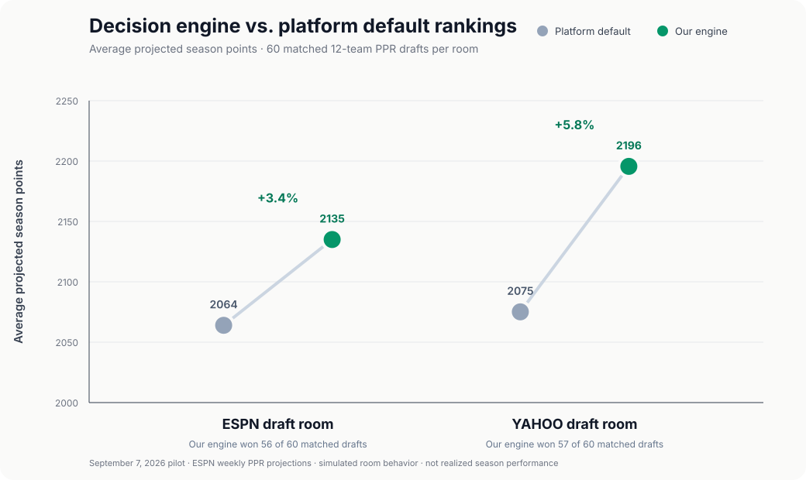

# Always-On Agents

*Experiments in agent-in-the-loop decision support.*

This project explores agents that follow a human-led task continuously and
intervene when they can reduce downside or surface a better action. The human
stays in control; the agent stays in context.

That pattern matters most in high-consequence work, clinical care, incident
response, and complex operations, where full automation may be inappropriate
but overlooking one signal can be costly.

## Fantasy football as a test bed

A fantasy draft is a low-stakes, reproducible version of this problem. It is a
finite-horizon, multi-agent allocation game with stochastic outcomes,
combinatorial roster constraints, opportunity cost, replacement value, and
optimal timing. The user still makes the picks; the agent listens and helps
protect against downside.



In 120 matched simulations using September 7, 2026 draft-room rankings, our
decision engine produced **3.4% more projected points than ESPN's default
ordering** and **5.8% more than Yahoo's**. It won 113 of the 120 comparisons.
For the user, that means better turn-by-turn recommendations without giving up
control of the draft.

These are ESPN-projected points, not realized season results. This pilot shows
that the decision system can improve on the defaults under a fixed objective;
the 2026 season is the forward test of the projections themselves.

## Product and post-training system

- A replayable draft environment with changing boards and simulated opponents.
- A deterministic engine for projections, roster constraints, replacement
  value, and pick-timing decisions.
- An agent harness where an open model can use those tools, recommend, or
  abstain while the human makes each pick.
- Multiple Qwen3.5-9B LoRA runs through Tinker, including an 811-trace SFT run
  and targeted rank-16/rank-32 adapters.
- Reproducible corpora, masked identities, saved and reloadable checkpoints,
  base-versus-adapter comparisons, and exact request-level cost accounting.
- Frozen, matched evaluations that score both individual decisions and complete
  15-pick trajectories.

## Research decision

The adapters improved training loss and structured behavior, but they did not
reliably improve complete drafts. Small interventions changed later states and
compounded. We stopped the training path instead of tuning against the frozen
holdout or proceeding to RL without a trustworthy reward signal.

That evidence produced the current product boundary: deterministic code solves
the numerical optimization and already beats the platform baselines in the
pilot; post-training focuses on whether to interrupt the human, which approved
action to surface, and when to stay quiet.

## Stack

| Layer | Implementation |
|---|---|
| Model | Qwen3.5-9B, LoRA |
| Training | Tinker, modular Prime backend |
| Environment | Python, multi-turn DraftGym |
| Decision tools | Projections, VORP, roster feasibility, survival probability |
| Evaluation | Point-in-time data, matched simulations, frozen holdouts, bootstrap intervals |
| Validation | 507 tests covering replay, leakage, determinism, and tool legality |

## Run locally

```bash
python3 -m venv .venv
.venv/bin/pip install -e '.[dev,tinker]'
.venv/bin/pytest -q
python -m evals.current_platform_pilot --date 2026-09-07
```

Start with the [project brief](docs/project-brief.md), the
[latest intervention experiment](docs/high-confidence-override-experiment.md),
or the [machine-readable pilot scorecard](artifacts/current-platform-pilot-v1/scorecard.json).
